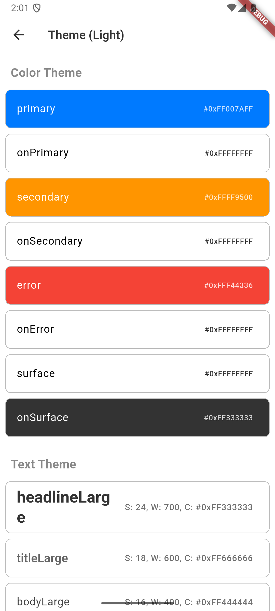
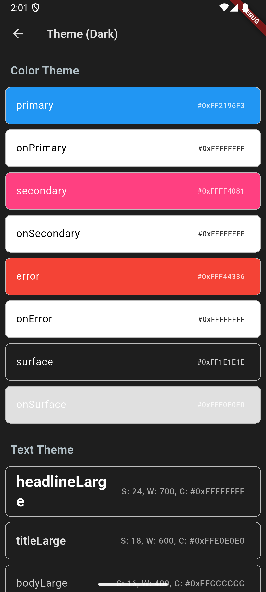

# Theme/Font 디자인 가이드

이 문서는 앱의 ColorScheme, TextTheme, 다크/라이트 모드, 접근성 가이드, 미리보기 스크린샷 등을 정리한 디자인 가이드입니다.

## 1. ColorScheme

| 이름        | HEX 코드   | 용도         |
|-------------|-----------|--------------|
| primary     | #007AFF   | 주요 색상    |
| secondary   | #FF9500   | 보조 색상    |
| error       | #FF0000   | 에러         |
| surface     | #FFFFFF   | 배경         |

## 2. TextTheme

| 이름           | 폰트 크기 | 굵기   | 색상    | 샘플 텍스트 |
|----------------|-----------|--------|---------|-------------|
| headlineLarge  | 24        | Bold   | #333333 | 헤드라인 샘플 |
| titleLarge     | 18        | Semi   | #666666 | 타이틀 샘플   |
| bodyLarge      | 16        | Normal | #444444 | 본문 샘플     |

## 3. 다크/라이트 모드 비교

| 모드   | primary | surface | 텍스트(헤드라인) |
|--------|---------|---------|-----------------|
| Light  | #007AFF | #FFFFFF | #333333         |
| Dark   | #2196F3 | #1E1E1E | #FFFFFF         |

## 4. ThemeScreen 미리보기

- 라이트 모드: 
- 다크 모드: 

## 5. 접근성/가독성 가이드

- 컬러 대비(contrast)는 WCAG AA 기준 이상을 권장
- 폰트 크기, 굵기, 색상은 ThemeData/TextTheme에 정의된 값 사용
